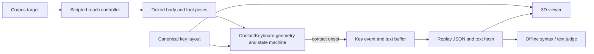
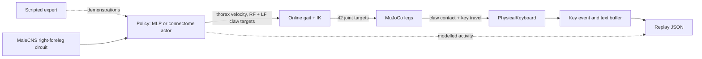

# FlySlop architecture

## First milestone

The current application is a deterministic, scripted reach demonstration. It proves a narrow chain: a pose crosses the keyboard contact threshold, a contact event identifies the key, a key event updates the authoritative text buffer, and replay reconstructs that buffer. It is not a trained policy, walking physics, or a connectome experiment.



Python owns simulation ticks, poses, contact detection, emitted characters, text, and validation. The browser client consumes `/api/replay` and renders the supplied layout and ordered events. A viewer may interpolate between recorded poses, but it must not create scored key events. Replay validation reconstructs text from contact and key events without running a controller.

## Physics and learning (added 2026-09-26)



`GET /api/replay?target_id=<id>&source=kinematic|physics|policy` selects the
generator. `policy` needs `python -m backend.server --policy <checkpoint.zip>`.
`GET /api/sources` lists what is available. A connectome-actor replay adds
`connectome: {groups, types, positions_um, activity_int8_b64, activity_shape, activity_scale}`,
with one activity row per frame.

## Current replay contract

`GET /api/replay?target_id=<id>` returns a JSON object with `metadata`, `layout`, `events`, `target`, `final_text`, `final_text_hash`, and `validation`.

- `metadata` identifies `target_id`, controller mode, observation condition, seed, tick rate, body model, and contact threshold.
- `layout.keys[]` contains `id`, `label`, `x`, `y`, `width`, `height`, `output`, and `shift_output`. `layout.unit` is `one key pitch`; `surface_z` is `0`.
- Events are ordered by monotonically increasing integer `tick`. Pose records carry `type: "pose"`, `body: {x,y,z}`, and `foot_pose: {x,y,z}`. Contact records use `type: "contact_onset"` or `"contact_offset"` with `key_id` and `foot`. Emitted key records use `type: "key"`, `key_id`, `foot`, and `char`; they also include resulting `text` and `text_hash`.
- `target` is the transcription target. `final_text` and its SHA-256 `final_text_hash` are authoritative output. `validation` is calculated after the episode; it is not an input to the reach controller.

Optional or future event fields must not change these meanings. In particular, text is reconstructed from `key` events that have an active matching contact. The viewer must not accept free-standing character events.

## Trust and extension boundaries

The first scripted controller can read the selected target because it is a deterministic demonstration fixture. This mode cannot support a learning or pixels-only claim. A later learned controller needs a separate observation interface and evaluation protocol that withholds target text and judge output. Name the condition in replay metadata.

Later stages may replace the scripted poses with a physics-backed body and add sampled neural activity. Those additions should retain a single simulation clock and the contact-to-key-to-text chain. Anatomy, modeled neural activity, and controller output need separate labels. No activity visualization alone demonstrates that connectome wiring caused a typing improvement.

## Reuse decision

FlyLab is pinned and audited in [reuse-audit.md](reuse-audit.md). Reuse its contact-gated interaction pattern and consider selective MIT-licensed scene/inspector adaptation after reviewing copied files and attribution. Do not use its static seated body as a locomotion model or its HTML-heading policy results as SystemVerilog evidence. Keep FlySlop's replay contract as the boundary for any replacement viewer or simulator.

## Contracts (P0, frozen)

Frozen 2026-09-29 by work package P0 of `PLAN.md`. Later packages implement against these; changing one needs an explicit note here. Nothing below is implemented yet except where marked *(exists)*.

### C0. RAM cap (applies to every package)

Hard project limit: **4 GB total RSS** (process tree), configurable with env `FLYSLOP_MAX_RAM_GB` (default `4.0`; the env var overrides a config value). All heavy code goes through `backend/memory_budget.py` *(exists)*:

- `max_ram_bytes(config_gb=None)`, `current_rss(pid=None, tree=False)`, `peak_rss()`.
- `check_fits(nbytes, label, raise_error=False)` before any large allocation (dense matrices, model loads, replay buffers). Returns False (or raises `OverBudget`) and the caller must skip or shrink.
- `start_watchdog(interval_s=1.0, fraction=1.0)`: daemon thread, `os._exit(87)` with a message when tree RSS exceeds the cap. macOS ignores `RLIMIT_AS`, so this is the enforcement. Every CLI entry point (training, extractors, teacher, orchestrator) calls it.
- `worker_budget(per_worker_bytes, reserve_bytes, max_workers)`: number of parallel workers that fit. Training and demo pools must use it instead of a fixed process count.
- The teacher selects MLX on Apple silicon and Torch on CUDA or CPU elsewhere. Gemma E2B's MLX build uses about 2.5 GB MLX memory and 1.2 GB RSS; Torch Gemma weights are much larger, so CUDA runs check available VRAM and CPU loads remain subject to the configured RAM cap. MuJoCo workers must not run concurrently with it.

### C1. Device and connectome backend (measured)

`backend/connectome/device.py` *(exists)*: `resolve_device("auto"|"cpu"|"cuda"|"mps")`; `auto` selects an available CUDA GPU, then Apple MPS, then CPU. Benchmark data remains available for backend tuning but does not override live device availability.

| size | batch | device | backend | fwd ms | fwd+bwd ms |
|---|---|---|---|---|---|
| 360 | 1 | cpu | dense | 0.05 | 0.29 |
| 360 | 1 | cpu | csr_fn (custom autograd) | 2.4 | 5.4 |
| 360 | 1 | cpu | index_add_ | 1.3 | 2.2 |
| 360 | 1 | mps | dense | 0.27 | 0.86 |
| 4k | 64 | cpu | csr_fn | 8.2 | 32.8 |
| 4k | 64 | cpu | index_add_ | 38.8 | 88.6 |
| 4k | 64 | mps | dense (16M params, ignores sparsity) | 8.6 | 29.9 |
| 4k | 64 | mps | index_add_ | 64.5 | 94.9 |
| 20k | 64 | cpu | csr_fn | 53.2 | 195.3 |
| 20k | 64 | cpu | index_add_ | 192 | over RAM budget |
| 20k | 64 | mps | index_add_ | 319 | 446 |

Stock `torch.sparse_csr_tensor` (row `csr`): forward works on CPU (about 11 ms at 4k) but **backward w.r.t. the values fails** ("SparseCompressedTensorBackward0 returned an invalid gradient"), and CSR is **not implemented on MPS** at all (`new_compressed_tensor`). `csr_fn` is a hand-written `torch.autograd.Function` (forward CSR matmul, backward `gvals = (G[row]*R[col]).sum` plus a transposed-CSR matmul); its gradient is tested against `index_add_` in `tests/test_device_and_teacher.py`. `index_add_` backward works on CPU and MPS but is 2 to 4 times slower than `csr_fn` on CPU. Dense 20k needs 1.6 GB per matrix and is skipped or forward-only under the cap.

**Decision.** Runtime backend = `csr_fn` on **CPU** for the typing circuit (about 3.6k neurons) and the thinker (5k to 20k). Use `dense` on CPU for the 360-neuron legacy actor. `index_add_` is the portable fallback (it is the only sparse backend that runs on MPS). MPS wins only for a 4k dense-masked matrix (about 2x), which does not justify a second code path. `runtime.py` must expose `backend in {"dense","csr_fn","index_add"}` with `csr_fn` as default.

### C2. Key-command schema

A **key command** is what the thinker/planner hands the typing controller for one physical press:

```json
{"key": "<key id>", "mods": ["ShiftLeft"], "hold": false}
```

- `key`: one of the 78 ids in `backend/keyboard.py::LAYOUT`. Printable keys use their unshifted character as id (`"a"`, `"1"`, `";"`, `"\\"`, `"`"`). Full set: `Escape F1..F12 Power`; `` ` 1..0 - = Backspace ``; `Tab q..p [ ] \`; `CapsLock a..l ; ' Enter`; `ShiftLeft z..m , . / ShiftRight`; `Fn ControlLeft AltLeft MetaLeft Space MetaRight AltRight ArrowLeft`; `ArrowUp ArrowDown ArrowRight`.
- `mods`: modifier key ids that must be **held down** when `key` makes contact. Only `ShiftLeft`, `ShiftRight`, `Fn` are semantically used; Control/Alt/Meta/CapsLock/Escape/F-keys/Power are physically present, emit nothing, and are never planned.
- `hold`: `true` only for a bare modifier command (`key` in `{ShiftLeft,ShiftRight}`, `mods=[]`) meaning "press and keep down"; the matching release is a command `{"key": "<same>", "release": true}`.
- **Shift is held, not latched.** Shift is active from its contact onset until its contact offset (foot lift) or an explicit release command. A bare Shift tap emits nothing and changes nothing afterwards. The legacy one-shot latch (`ContactKeyboard.shift_latched`) stays as `shift_mode="latch"` for the old scripted/PPO modes (they must remain reproducible); the new modes use `shift_mode="held"`. The Shift-selected character is `key.shift_output`.
- Physical chords (Shift+key, Fn+key) are realised as "modifier contact still active when the main key's `contact_onset` fires". In symbolic-only training a chord is atomic. A `key` event is legal only with a matching active contact, as before.
- **This laptop has no Home/End/forward-Delete keys, so they are Fn chords** (macOS convention): forward Delete = `Fn+Backspace`, Home = `Fn+ArrowLeft`, End = `Fn+ArrowRight`. `Backspace` alone deletes backwards (the keycap reads "delete").
- Editor effect of each key (P4 implements): printable = insert `output`/`shift_output` (replaces a selection); `Enter` = insert `"\n"` (no auto-indent); `Tab` = insert four spaces; `Backspace` = delete the selection or the character before the cursor; `Fn+Backspace` = delete the selection or the character after; arrows move the cursor by one char or line (`Up`/`Down` keep the goal column, clamped to line length); `Fn+Left/Right` = line start/end; any of these with Shift held **extends the selection** (anchor fixed at the position where selection began); a plain move with a selection collapses it.

### C3. Action-token schema (thinker output)

One flat vocabulary. Ids are fixed; the BPE trained in P5 starts at id 32 (ids 16 to 31 are reserved for future control tokens).

| id | token | meaning | expansion |
|---|---|---|---|
| 0 | `<PAD>` | padding | none |
| 1 | `<BOS>` | start of sequence | none |
| 2 | `<EOS>` | stop editing this program | none (ends the episode) |
| 3 | `<RUN>` | run tests, feed output back (stage 9) | none (environment action) |
| 4 | `<ENTER>` | newline | `Enter` |
| 5 | `<TAB>` | indent (four spaces) | `Tab` |
| 6 | `<BS>` | delete backward | `Backspace` |
| 7 | `<DEL>` | delete forward | `Fn+Backspace` |
| 8 to 11 | `<LEFT> <RIGHT> <UP> <DOWN>` | cursor move | matching arrow |
| 12, 13 | `<HOME> <END>` | line start/end | `Fn+ArrowLeft`, `Fn+ArrowRight` |
| 14 | `<SEL_START>` | begin selection: Shift goes down and stays down | `{ShiftLeft, hold}` |
| 15 | `<SEL_END>` | end selection: Shift released, selection kept | `{ShiftLeft, release}` |
| 32+ | BPE text tokens | literal text | one key command per character |

Justification: shift-held movement is exactly what the physical keyboard does, but a bare "Shift+arrow" token per direction would multiply the vocabulary by 6. Bracketing with `<SEL_START>` / `<SEL_END>` keeps ten edit tokens, maps onto the held-Shift state machine, and gives the diff-oracle a simple selection plan (`SEL_START`, moves, then typing/`<BS>` replaces or deletes). While the selection is active the moves extend it. `<SEL_START>` when already active, `<SEL_END>` when inactive, and any edit token at a boundary that would not change the buffer (`<LEFT>` at offset 0) are legal no-ops and count toward the keystroke budget. Newline and tab are edit tokens, never inside BPE text tokens: BPE text tokens contain only printable ASCII (0x20 to 0x7E, all covered by `CHAR_TO_KEY`, verified), which keeps token-to-keys expansion total and unambiguous. Indentation is typed as spaces or `<TAB>` (four spaces). Base alphabet of the BPE = the 95 printable ASCII characters, so any line is encodable.

**Expansion rule (deterministic, in `backend/keyplan.py`):** `expand(token) -> list[KeyCommand]`. A BPE token expands character by character: `c -> CHAR_TO_KEY[c] = (key_id, shifted)`, giving `{"key": key_id, "mods": ["ShiftLeft"] if shifted else []}`. Space is `Space`. The planner may merge consecutive shifted characters under one Shift hold, but the default is one self-contained chord per shifted character. Edit tokens expand per the table. `expand` never emits anything for `<PAD> <BOS> <EOS> <RUN>`. Round trip: applying `expand(t)` to the editor and applying the token semantics to a string model give the same buffer, cursor and selection (property test in P4).

### C4. Editor-event schema

Each emitted key extends the existing `key` replay event with editor fields (the old fields keep their meaning; `text` and `text_hash` stay, so old replays and `replay_text` still work; new fields are optional for legacy replays):

```json
{"tick": 1234, "type": "key", "key_id": "ArrowLeft", "foot": "left_foreleg",
 "key": "ArrowLeft", "modifiers": ["ShiftLeft"], "char": "",
 "op": "move", "cursor_before": 12, "cursor_after": 11,
 "selection_before": null, "selection_after": {"anchor": 12, "head": 11},
 "text": "<buffer after>", "text_hash": "<sha256 of buffer after>", "buffer_hash": "<same as text_hash>",
 "contact_id": 57}
```

- `tick`: simulation tick, monotonically non-decreasing. `key`/`key_id`: the pressed key (`key_id` is the legacy name; both present). `modifiers`: ids held at contact onset. `char`: text inserted ("" for non-inserting keys, and for Tab it is the four spaces).
- `op`: `insert | backspace | delete | move | select | none` (`select` = a move with Shift held; `none` = no effect, e.g. a modifier or `<LEFT>` at offset 0).
- Cursor and selection are **character offsets** into the buffer (`0..len`). `cursor` equals the selection `head`; `selection_*` is `null` or `{"anchor": int, "head": int}`.
- `buffer_hash`: SHA-256 hex of the UTF-8 buffer after the event (same function as `text_hash`).
- `contact_id`: integer from a per-episode counter, assigned to each `contact_onset` (new field `contact_id` on `contact_onset`/`contact_offset` events) and repeated on the `key` event it produced. **A `key` event without a matching earlier `contact_onset` with the same `contact_id`, `key_id`, and an unreleased contact is invalid**; `replay_text` must reject it, exactly as it rejects contactless events today. Modifier presses emit a `modifier` event (existing type) with `state` `shift_down | shift_up | fn_down | fn_up`.
- Replay of the final state: applying the `key` events in order to an empty editor must reproduce the last `buffer_hash`, cursor and selection.
